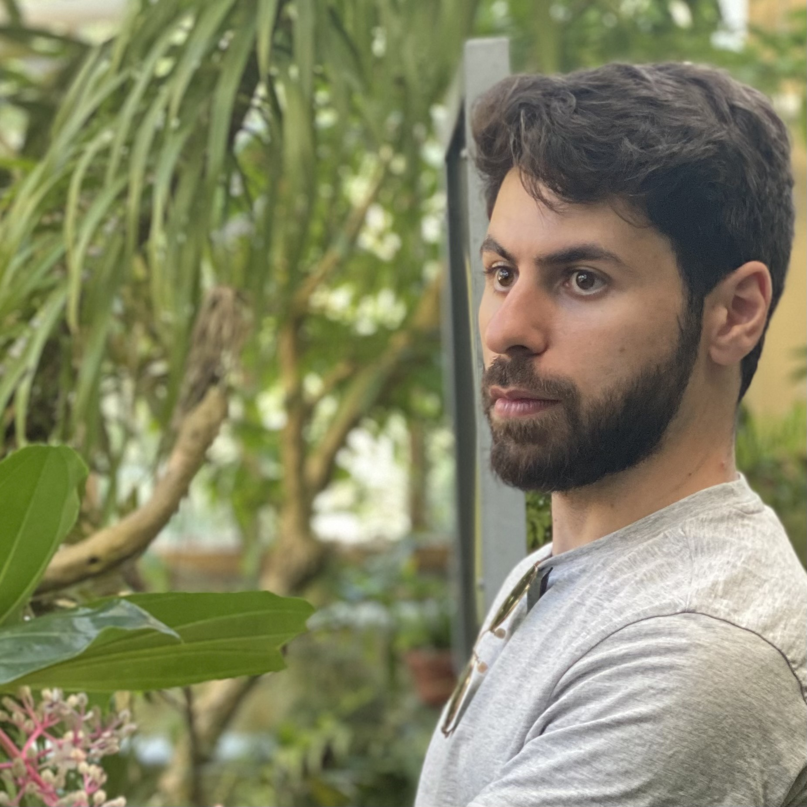

{width=220px}

# Mohammed Mudarris

PhD Candidate  
Health, Medical, Neuropsychology
Institute of Psychology  
Faculty of Social and Behavioural Sciences
Leiden University

My research focuses on neuroplasticity of motor learning with multisensory stimulation in aging and neurological disease. Using multimodal MRI methods, I examine structural, functional, and network-level brain changes associated with motor learning and rehabilitation.  

## Research Interests

- Multimodal Neuroimaging
- Motor learning & cognition
- Aging and stroke
- Multisensory stimulation
- Music-based rehabilitation
- Cognitive-motor interference
- Hierarchical modelling

---

## Links
### Research
[OSF](https://osf.io/e834b/)

[Google Scholar](https://scholar.google.com/citations?user=0kUG_e4AAAAJ&hl=en)

[ORCID](https://orcid.org/0000-0003-3649-5423)

[ResearchGate](https://www.researchgate.net/profile/Mohammed-Mudarris)

### Socials

[LinkedIn](https://www.linkedin.com/in/mamudarris/)

[Bluesky](https://bsky.app/profile/mamudarris.bsky.social)

[Twitter](https://x.com/mamudarris)

---

## Contact
Email: [mamudarris@gmail.com](mailto:mamudarris@gmail.com)
